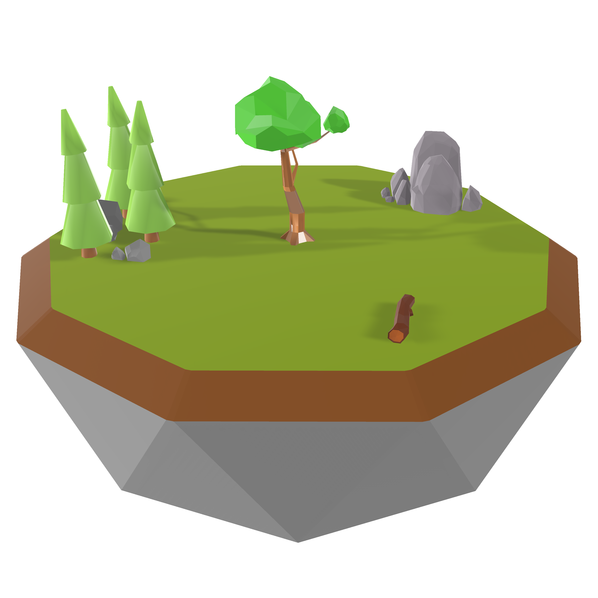

# 어라운드 더 월드 (Around The World)

> 작은 행성 위에서 떨어지는 운석을 피하고, 코인을 모으는 3D 무한 러너.
> three.js + cannon-es로 만든 WebGL 브라우저 게임입니다.



---

## 게임 소개

**어라운드 더 월드**는 작은 구 형태의 행성 한가운데 서서 점점 쏟아지는 운석을 피하고 코인을 모으는 3D 아케이드 게임입니다. 평평한 지형 위의 게임이 아니라 **구 형태의 행성 표면을 따라** 캐릭터가 회전·달리고, 자체 구현한 **방사형 중력**(행성 중심으로 잡아당기는 힘) 위에서 물리 시뮬레이션이 돌아갑니다.

코드를 직접 들여다보면 단순한 비주얼 데모가 아니라 **게임 루프, FSM(상태 머신), 오브젝트 풀링, 모듈형 환경/물리 시스템**까지 갖춘 구조를 확인할 수 있습니다. three.js와 cannon-es로 3D 게임이 어떻게 구성되는지 살펴보기에 좋은 학습용 코드베이스예요.

---

## 주요 특징

- **three.js 기반 3D 렌더링** — FBX 캐릭터 모델, 행성, 별, 달, 운석, 코인까지 모두 WebGL로 그립니다.
- **cannon-es 물리 엔진** — 방사형 중력, 운석 충돌, 캐릭터 점프, 행성 표면 미끄러짐까지 시뮬레이션.
- **방사형 중력 시스템** — `main.ts`의 `_applyCustomGravity()`에서 행성 중심으로 끌어당기는 힘을 직접 구현. 표준 중력으로는 절대 못 만드는 곡선 위 동작이 핵심 재미 요소입니다.
- **캐릭터 FSM** — `idle / walk / run / walkback / runback / dying` 6개 상태로 동작. 각 상태 진입·이탈 시 애니메이션 블렌딩(`crossFadeFrom`) 처리.
- **오브젝트 풀링** — 운석(`Meteor`)과 코인(`Coin`)은 미리 `MAX_COUNT`개 생성해 두고 활성/예약(`active` / `reserved`) 맵으로 재활용. 메모리·GC 부담 최소화.
- **FBX 모델 + 애니메이션** — Mixamo의 캐릭터 모델과 애니메이션을 로드해 자연스러운 캐릭터 동작 구현.
- **조이스틱 + 키보드 동시 지원** — 데스크탑은 WASD/스페이스/쉬프트, 모바일은 `nipplejs` 가상 조이스틱으로 조작.
- **단계적 난이도** — 운석 수는 `INITIAL_COUNT=5`에서 시작해 7.5초마다 1개씩 늘어나 `MAX_COUNT=25`까지 증가.
- **상태별 사운드** — 배경음악, 코인 효과음, 발자국 합성음(웹 오디오 API로 직접 생성)까지 분리.
- **반응형 카메라** — 3인칭 카메라가 행성 표면에 맞춰 부드럽게 추적.

---

## 조작법

| 키 | 동작 |
| --- | --- |
| `W` | 앞으로 걷기 / 달리기 |
| `S` | 뒤로 걷기 / 달리기 |
| `A` / `D` | 좌우 회전 |
| `Space` | 점프 |
| `Shift` | 달리기 (걷기와 함께 사용) |

모바일 / 터치 환경에서는 화면 좌하단의 가상 조이스틱으로 이동·달리기, 점프는 화면 탭으로 동작합니다.

> **목표**: 운석에 맞지 않고 가능한 한 오래 버티면서 코인을 많이 모으세요.
> 시간이 지날수록 운석이 점점 더 많이 떨어집니다.

---

## 기술 스택

| 영역 | 사용 기술 |
| --- | --- |
| **3D 렌더링** | [three.js](https://github.com/mrdoob/three.js) ^0.185.1 |
| **물리 엔진** | [cannon-es](https://github.com/pmndrs/cannon-es) ^0.20.0 |
| **물리 디버거** | [cannon-es-debugger](https://github.com/pmndrs/cannon-es-debugger) ^1.0.0 |
| **FBX → Cannon 변환** | [three-to-cannon](https://github.com/donmccurdy/three-to-cannon) ^5.0.2 |
| **모바일 조이스틱** | [nipplejs](https://github.com/yoannmoinet/nipplejs) ^0.10.2 |
| **언어** | TypeScript ^5.9.3 |
| **번들러** | webpack ^5.110.2 |
| **린트 / 포맷** | gts ^7.0.0 |
| **런타임** | Node.js >= 22.15.0 |

---

## 코드베이스 구조

```
src/
├── main.ts                # 게임 진입점 + World 클래스 (렌더/물리 루프)
├── menu.ts                # 시작/게임오버 메뉴 관리
├── audio.ts               # AudioManager (BGM/효과음/발자국)
├── camera.ts              # 3인칭 카메라 (전환 애니메이션 포함)
├── character.ts           # 캐릭터 컨트롤러 (물리 바디 + 애니메이션)
├── characterAnimations.ts # 캐릭터 FSM (idle/walk/run/walkback/runback/dying)
├── characterInput.ts      # 키보드 + 조이스틱 입력 처리
├── config.ts              # 모든 튜닝값 (행성 반경, 중력, 난이도 등)
├── environment.ts         # 행성/별/달/운석/코인 총괄 매니저
└── objects/
    ├── index.ts           # 배럴 export
    ├── ball.ts            # 물리 공 (테스트용)
    ├── coin.ts            # 코인 (오브젝트 풀링)
    ├── meteor.ts          # 운석 (오브젝트 풀링)
    ├── moon.ts            # 달
    ├── planet.ts          # 행성 (FBX → cannon 메시)
    └── stars.ts           # 별 파티클 (2500개)
```

### 핵심 아키텍처 포인트

- **`World` 클래스 (`src/main.ts`)** — 게임의 모든 시스템을 조립·실행하는 컨트롤 타워. `INITIALIZING / IDLE / PLAYING / GAME_OVER` 4단계 상태로 전체 흐름을 관리.
- **방사형 중력 (`_applyCustomGravity`)** — cannon-es의 기본 중력을 끄고 `postStep` 이벤트에서 행성 중심을 향해 동적 바디들을 끌어당김. 이게 곡선 표면을 따라 자연스럽게 걸을 수 있는 비결.
- **FBX 로더 타임아웃 (`_loadFBXWithTimeout`)** — 모델 로드가 무한 대기하지 않도록 30초 타임아웃을 걸어둔 부분이 인상적.
- **Meteor / Coin 풀링** — 게임 시작 시 `MAX_COUNT`개를 미리 만들어 두고 충돌/획득 후엔 풀로 반환. 매번 생성/파괴하지 않음.

---

## 실행 방법

### 1. 의존성 설치

```bash
npm install
```

### 2. 개발 서버 실행

```bash
npm run dev
```

기본 포트는 `9000`. 브라우저에서 `http://localhost:9000` 접속.

### 3. 프로덕션 빌드

```bash
npm run build
```

`build/main.js`와 `index.html`, `static/`, `resources/`가 생성됩니다. 정적 호스팅 어디든 그대로 올리면 동작.

### 4. 타입 체크

```bash
npm run compile
```

### 5. 린트 / 자동 수정

```bash
npm run lint   # 검사만
npm run fix    # 자동 수정
```

---

## 게임 설정값 튜닝

`src/config.ts` 한 파일에 모든 튜닝값이 모여 있어요. 게임의 난이도·물리 느낌이 궁금하면 이 파일을 먼저 보세요.

| 키 | 기본값 | 설명 |
| --- | --- | --- |
| `CHARACTER.BODY_RADIUS` | `8` | 캐릭터 충돌체 반경 |
| `CHARACTER.VELOCITY_FACTOR` | `1.5` | 이동 속도 배율 |
| `CHARACTER.JUMP_FORCE` | `5000000` | 점프 힘 |
| `CAMERA.OFFSET` | `{x:-15, y:28, z:-30}` | 카메라 거리 |
| `PHYSICS.PLANET_RADIUS` | `100` | 행성 반경 |
| `PHYSICS.GRAVITY_FORCE_SCALE` | `300` | 방사형 중력 세기 |
| `METEORS.INITIAL_COUNT` | `5` | 시작 시 운석 수 |
| `METEORS.MAX_COUNT` | `25` | 운석 상한 |
| `METEORS.INCREASE_INTERVAL` | `7500` | 운석 증가 주기 (ms) |
| `COINS.MAX_COINS` | `20` | 코인 풀 크기 |
| `RENDERING.SHADOW_MAP_SIZE` | `1024` | 그림자 해상도 |

---

## 라이선스 / 크레딧

원작자: **[toodom02](https://github.com/toodom02/AroundTheWorld)** — 본 저장소는 한글화와 추가 배포 자동화가 포함된 한국어판입니다. 모든 저작권과 라이선스는 원본 저장소의 정책(저장소 참조)을 따릅니다.

### 사용된 외부 리소스

`resources/Attributions.md`에 정리되어 있습니다.

- **캐릭터 모델 및 애니메이션** — [Mixamo](https://www.mixamo.com/)
- **행성 / 운석 / 코인 모델** — [Quaternius](https://quaternius.com/) (Poly Pizza)
- **효과음** — Pixabay (Crunchpix Studio)
- **배경음악** — Pixabay (Lesfm)
- **아이콘** — Flaticon (Pixel perfect) 수정본
- **농구공 텍스처** — [opengameart.org](https://opengameart.org/content/basket-ball-texture)

---

## 라이브 데모

이 저장소는 GitHub Pages로 자동 배포되도록 구성되어 있습니다. 최신 라이브 데모 URL은 저장소 상단의 `About` 영역 또는 `Pages` 설정에서 확인하세요.

---

## 참고 자료

- [three.js 공식 문서](https://threejs.org/docs/)
- [cannon-es 저장소](https://github.com/pmndrs/cannon-es)
- [three-to-cannon 저장소](https://github.com/donmccurdy/three-to-cannon)
- [nipplejs 저장소](https://github.com/yoannmoinet/nipplejs)
